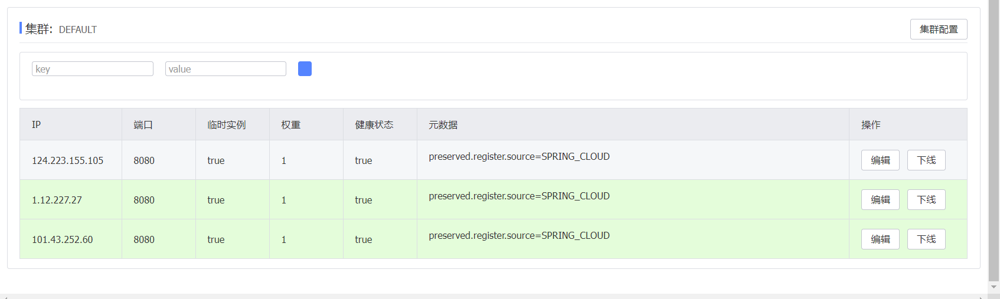

# EMall 笔记
## Nacos指定ip地址



**Spring**应用会默认将内网ip注册到nacos注册中心，如果服务器不在同一个内网网段，那么服务之间将无法互通，需要手动设置应用的公网ip。

通过设置docker运行参数，可以在docker运行时传入指定应用的公网ip。

```dockerfile
ENTRYPOINT ["sh","-c","java -Dfile.encoding=utf-8 -jar user-api.jar ${BOOT_OPTIONS}"]
```

```bash
# 不要忘记给服务器开端口
docker run -e "BOOT_OPTIONS=--spring.cloud.nacos.discovery.ip=101.43.252.60" -p 8080:8080 --name user-api -d ccr.ccs.tencentyun.com/emall/user-api
```

